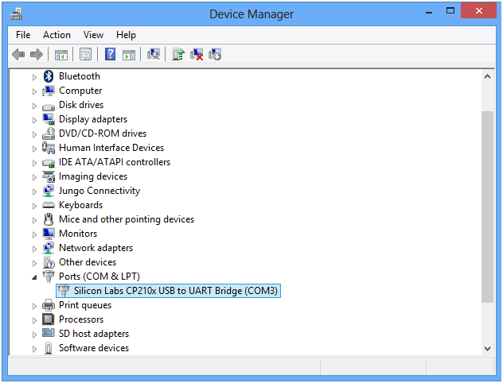
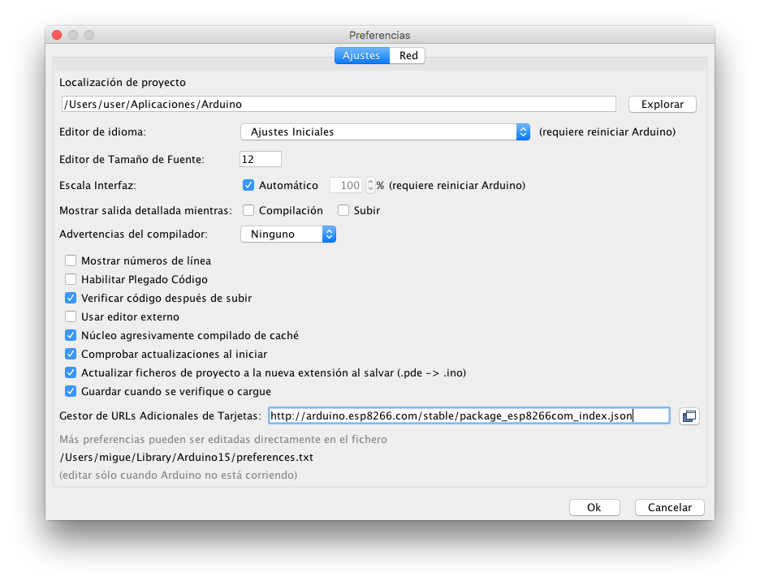

Guia de instalación y configuración de entorno para curso IoT FIWARE Zone

# Introducción

## ESP8266

El ESP8266 es un SoC que incluye un microcontrolador ARM 

# 

## FIWARE

# Configuración del entorno

## Instalación drivers USB

Los drivers para los distitnos sistemas operativos se pueden descargar desde la página web del fabricante:

[https://www.silabs.com/products/development-tools/software/usb-to-uart-bridge-vcp-drivers](https://www.silabs.com/products/development-tools/software/usb-to-uart-bridge-vcp-drivers)

### MAC OSX

Para identificar que tenemos instalado correctamente los drivers del dispositivo, podremos ver en el informe del sistema (acerca de este mac) el dispositivo USB CP2102 USB to UART Bridge Controller

En las últimas versiones de macOS es necesario habilitar el driver en el panel de control para que se ejecute. Para ello hay que ir a la sección de seguridad y privacidad y permitir la ejecución del software.

### Windows

Tras descargar y ejecutar el instalador del driver provisto por el fabricante, y tras reiniciar el equipo si fuera necesario, nos debe aparecer algo similar a la siguiente imagen en el administrador de dispositivos

Una vez identificado, habrá que recordar el puerto COM para configurarlo en la aplicación arduino

## Configurando Arduino

Antes de nada, es necesario de disponer del IDE de arduino. En caso que no se disponga ya, se puede descargar e instalar desde el siguiente enlace:

[https://www.arduino.cc/en/Main/Software](https://www.arduino.cc/en/Main/Software)

### Instalar ESP8266 en arduino

Lo primero que tenemos que añadir al repositorio de placas de desarrollo compatibles el repositorio GitHub donde se encuentra todo el entorno de ESP8266. Para ello, hay que abrir las preferencias y añadir la una nueva URL al gestor de tarjetas tal y como se ve en la siguiente imagen

Añadimos la siguiente URL:

[http://arduino.esp8266.com/stable/package_esp8266com_index.json](http://arduino.esp8266.com/stable/package_esp8266com_index.json)

Una vez añadida le damos a OK y vamos al gestor de tarjetas (Herramientas -> placa-> Gestor de tarjetas). Allí deberemos buscar la nueva tarjeta o placa que hemos añadido, en este caso, ESP8266. Seleccionamos la versión y le damos a instalar. Esto llevará unos minutos mientra se descargan todas las utilidades y librerías.

Ya sólo nos queda seleccionar la nueva tarjeta, en este caso la placa **NodeMCU V1.0 **para que el sistema nos detecte la placa.

Además, deberemos configurar el puerto serie que está empleando el sistema. En el caso de Windows, deberemos seleccionar el puerto COM correspondiente (el que aparece en la sección de instalación del driver). En el caso de macOS y Linux, deberemos seleccionar el dispositivo correspondiente con el formato /dev/* (dependiendo del sistema operativo)

Antes de continuar, vamos a instalar unas librerías que van a facilitar el uso de la placa:

WifiManager

[https://github.com/tzapu/WiFiManager](https://github.com/tzapu/WiFiManager)

<WiFiManager.h>          //https://github.com/tzapu/WiFiManager

<ArduinoJson.h>          //https://github.com/bblanchon/ArduinoJson

## Instalación de Postman

Para hacer pruebas con la API de FIWARE será necesario disponer de la herramienta Postman, para hacer peticiones HTTP a esta. Esta herramienta permite gestionar las colecciones de peticiones, por lo que será muy sencillo realizar las operaciones necesarias con la colección predefinida.

[https://www.getpostman.com](https://www.getpostman.com)

# Repositorio del curso

El código empleado en el curso, así como las librerías, las colecciones de Postman y 

