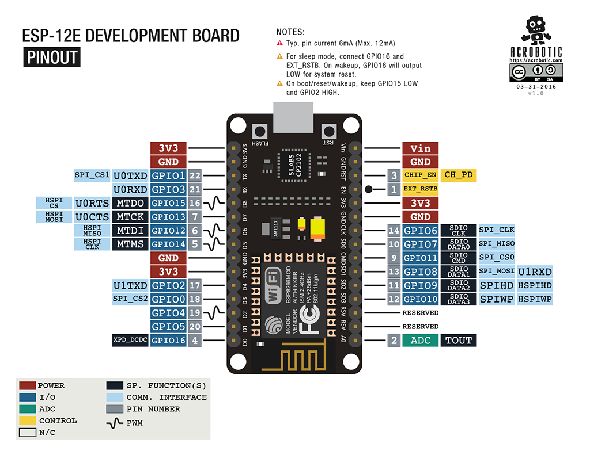
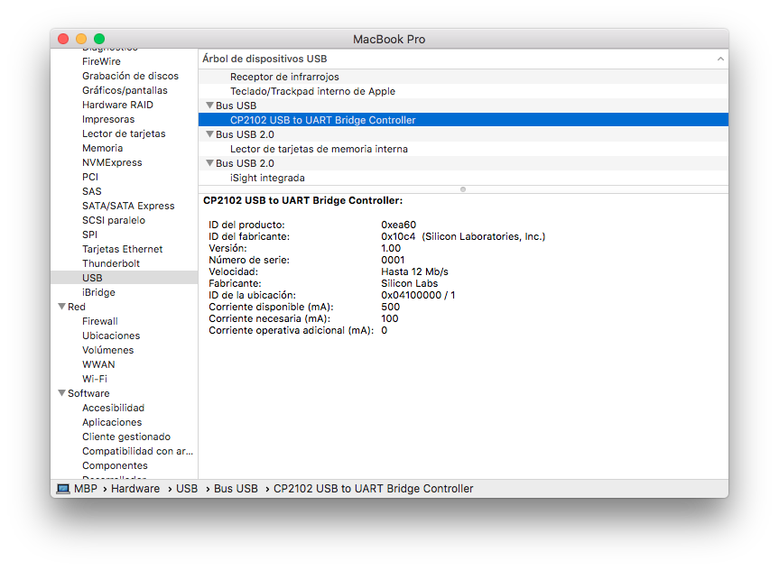
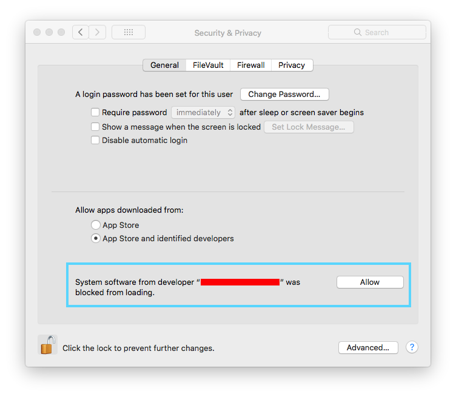
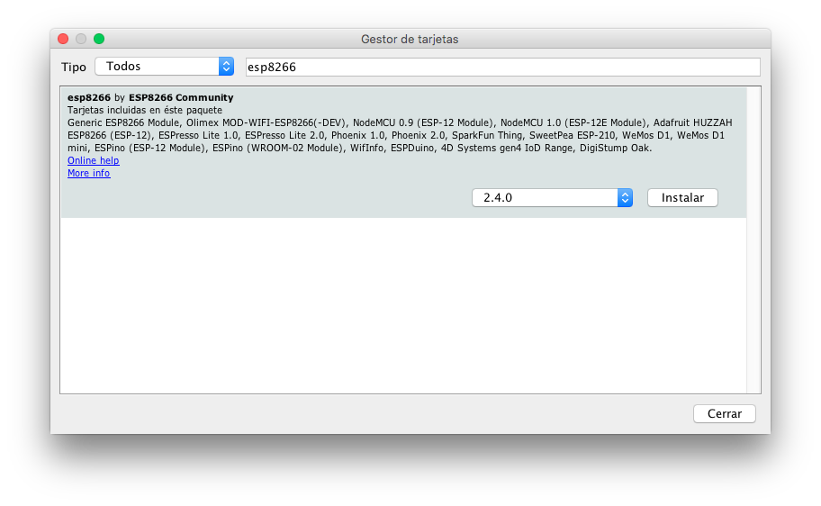

# Introduction

This course aims to help developers integrate an IoT device into the FIWARE platform. In this case the FIWARE IoT Agent modules will be used, which manage communication with Hardware devices, as well as other features (provisioning of devices, translation of protocol or parameters, etc.). In this specific case we will use the Ultralight 2.0 protocol in both the device and the IoT Agent.

The development board used will be a NodeMCU board based on the SoC ESP8266, which given its cost, capabilities and community, makes it suitable for this course. 

## ESP8266

The course will use a NodeMCU development board based on the SoC ESP8266, which includes a 32-bit ARM microcontroller as well as the WiFi radio part.

| Tables           | Are           |
| -----------------|--------------:|
| RAM              | 128KB         |
| ROM              | 4MB*          |
| Pin count        | 13            |
| Powering         | 3.3V          |

*The ROM is external, so it depends on the one that has installed the development plate. In the case of the NodeMCU board is 4MB.

The module has an internal regulator from 5V to 3.3V, so it can be powered directly from USB. In some cases it is convenient to use an external power adapter, since the current given by a PC through the USB port is limited to 500mA.

It also has a USB to USART 3.3V converter, used to communicate with the module and to load the firmware through the bootloader available.

## FIWARE

The objective of this workshop is to integrate a physical device into the FIWARE platform. To do this we will use the Ultralight 2.0 protocol and the corresponding IoT Agent on the server side.

The IoT Agents are modules that adapt the specific protocol used by the device (Ultralight 2.0, MQTT, etc.) with the protocol spoken by the FIWARE Context Broker (NGSI).

# Configuración del entorno

In this section we will review how to install and configure the necessary programs to develop the course. It will be necessary to have installed and configured correctly the following elements:
* USB drivers of the development board.
* Arduino development environment and the necessary libraries.
* Postman and the collection of requests from this repository.

## USB drivers installation

It is necessary to install the drivers for the USB to USART to 3.3V converter included on the development board. In the market there are different manufacturers of this board that can integrate different integrated circuits that perform this function. In this case, we will have to install the corresponding driver. In any case, there is no type of incompatibility between them, being able to install both in unison. In the following image we can differentiate the two most extended models that of converter of USB to USART in the plates NodeMCU, that are the CH430G and the CP2102/3

In the case of the CP2102/3 chip, from the SiLabs manufacturer, we will be able to download the drivers for the different operating systems from the manufacturer's website:

[https://www.silabs.com/products/development-tools/software/usb-to-uart-bridge-vcp-drivers](https://www.silabs.com/products/development-tools/software/usb-to-uart-bridge-vcp-drivers)

In the case of the CH430G chip, we will be able to download the drivers from the following web page:

[Windows](http://www.wch.cn/downloads/CH341SER_ZIP.html)

[MacOS](http://www.wch.cn/downloads/CH341SER_MAC_ZIP.html)

[Linux](http://www.wch.cn/download/CH341SER_LINUX_ZIP.html)

### MAC OSX

To identify that we have correctly installed the drivers of the device, we can see in the system report (about this mac) the USB device CP2102 USB to UART Bridge Controller or the corresponding to CH430G

In the latest versions of macOS it is necessary to enable the driver in the control panel for it to run. To do this, go to the security and privacy section and allow the software to run.

### Windows

After downloading and running the driver installer provided by the manufacturer and, if necessary, after restarting the computer should appear something similar to the following image in the device manager (depends on the USB driver to UART):

Once identified, you will have to remember the COM port to configure it in the arduino application.

### Linux

Generally, the latest versions of the linux kernel bring native support for this device. Otherwise, follow the manufacturer's instructions for the particular distribution.

## Configuring Arduino

First of all, you need the arduino IDE. If you don't already have it, you can download and install it from the following link:

[https://www.arduino.cc/en/Main/Software](https://www.arduino.cc/en/Main/Software)

### Installing ESP8266 on arduino

The first thing we need to add to the compatible development board repository is the GitHub repository where the entire ESP8266 environment is located. To do this, open the preferences (File -> Preferences) and add a new URL to the card manager as shown in the image below:

[http://arduino.esp8266.com/stable/package_esp8266com_index.json](http://arduino.esp8266.com/stable/package_esp8266com_index.json)

Once added, click OK and go to the card manager (Tools -> place-> Card manager). There we will have to look for the new card or plate that we have added, in this case the ESP8266. We select the version and we give him to install. This will take a few minutes while downloading all utilities and libraries.

Now we only have to select the new card, in this case the board **NodeMCU V1.0** so that the system detects the board.

In addition, we will have to configure the serial port that the system is using. In the case of Windows, we will have to select the corresponding COM port (the one that appears in the driver installation section). In the case of MacOS and Linux, we should select the corresponding device with the format /dev/* (depending on the operating system).

Before we continue, we are going to install some libraries that will facilitate the use of the board (search in Program -> Include Library -> Library Manager):

WiFiManager.h          - https://github.com/tzapu/WiFiManager

ArduinoJson.h          - https://github.com/bblanchon/ArduinoJson

